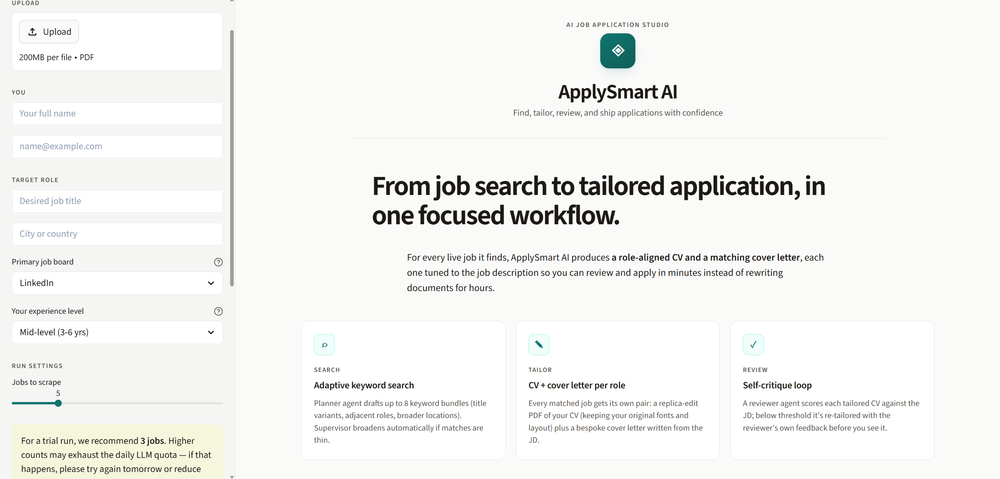
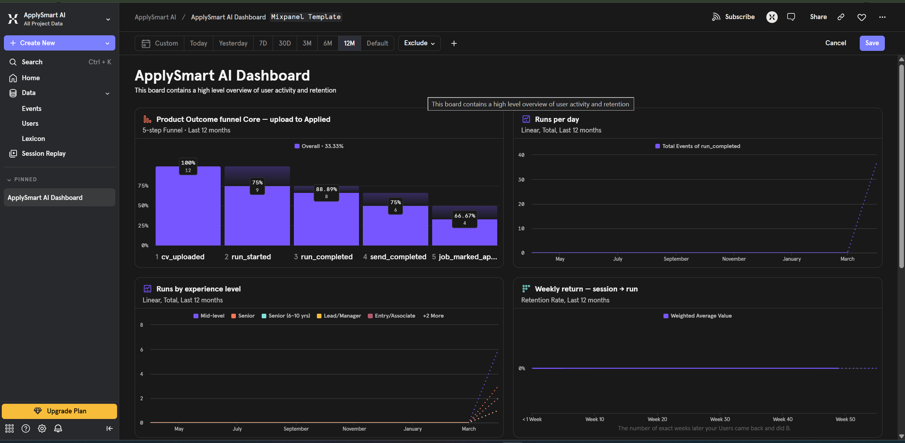

# ApplySmart AI — PM Case Study

> A multi-agent job application automation system, built as a product, documented as a product.
> 
> **Author:** Rishav Singh  
> **Role:** Product Manager (sole operator / PM-engineer on this project)  
> **Status:** v1.2 — deployed on Streamlit Community Cloud, continuing iteration
> **Last updated:** 22 April 2026

---

## 1. Executive Summary

**What:** An end-to-end LLM pipeline that takes a user's CV + target role, scrapes live job listings, scores fit, tailors the CV and cover letter per role while preserving the user's original layout, and sends the applications via email.

**Why:** Applying to 50 jobs manually takes 30-50 hours of copy-paste and generic rewrites that ATS systems filter out. Existing tools solve one slice each (builders, scrapers, AI rewriters) — none string them together into a tailored, honest, batch-capable pipeline.

**How it's different:**
- **Preserves the user's own CV layout** (in-place PDF edits, not template swaps)
- **Honest tailoring** — fabrication guardrails at the sanitizer + reviewer agent level
- **Deterministic filters before LLM** — YOE + experience level checks save 30-50% of LLM calls on broad scrapes
- **Crash-safe, observable** — snapshot per run, budget-capped, rate-limited

**Current bet:** The target market (job-seekers, especially adjacent-to-PM roles) will pay for *layout-preserving tailored applications at scale* more than they'll pay for another ChatGPT wrapper.

*The v1 UI — sidebar captures CV + target role + experience level + run settings; the canvas explains the three-agent flow (Search / Tailor / Review).*

---

## 2. Problem Statement

### 2.1 User pain, observed

Applying to jobs is:
1. **Tedious** — 30 mins per tailored application × 50 roles = 25 hours
2. **Demoralizing** — template-swap tools produce generic-looking CVs that feel dishonest
3. **Under-leveraged** — LLMs are individually used (ChatGPT copy-paste) but not pipelined end-to-end
4. **Fragile** — existing "AI resume builders" fabricate facts, violate ATS, or lose layout

### 2.2 Who I built this for

**Primary persona: Rishav (me) — Mid-career PM, 4 yrs experience, looking for the next role**
- Has a good CV already; doesn't want to rebuild it from a template
- Applies to 15-30 roles/month
- Needs each application tailored enough to pass ATS keyword filters + human skim
- Limited time; won't tolerate a tool that takes 10 minutes per application

**Secondary persona: Brother — Entry-level IT support, less CV experience**
- Doesn't know what to tailor or why
- Over-applies to roles he's under-qualified for (Senior listings)
- Needs the system to warn him, not waste his time

**Tertiary persona: Friend — 3 yrs marketing, career switcher**
- CV is strong but for the "wrong" roles
- Needs real rewording, not just keyword stuffing
- Was seeing 10-YOE matches despite being mid-career — hard filter needed

### 2.3 Why not existing tools

| Tool | Gap |
|---|---|
| **ChatGPT / Claude** | One CV at a time, no pipeline, lose PDF layout, manual copy-paste, no job scraping |
| **Resume.io / Zety** | Static templates, not LLM-tailored, can't batch, locked to their layouts |
| **Easy Apply** | Same generic CV to every role, no tailoring |
| **Rezi / Teal** | Good at ATS optimization, but template-swap not layout-preserving; limited batching |
| **Scrapers (Scrapy, SerpAPI)** | Only the top of funnel; nothing downstream |

The gap: **end-to-end, layout-preserving, batch, honest**.

---

## 3. Product Bets

Bets ranked by conviction. Each is falsifiable.

### Bet 1: Users trust their own CV layout more than a template
**Test:** If users actively reject template-rebuild tools (ResumeIO, etc), they will prefer in-place editing.  
**Evidence:** My friend's specific feedback — "don't butcher my CV, just sharpen the text."  
**Decision impact:** Chose PyMuPDF in-place editing over ReportLab rebuild (see ADR-001).  
**Risk:** Fails on multi-column designer CVs (Novoresume, Canva) — scoped to v2.

### Bet 2: Diff-based tailoring beats full-CV rewrite
**Test:** Users accept minimal, targeted edits more than whole-CV regens.  
**Evidence:** Full rewrites repeatedly introduced fabrication (invented tools, inflated numbers); diff tailoring of ~5 bullets + summary sidesteps this.  
**Decision impact:** Chose diff-tailor pattern with structured JSON output (see ADR-003).  
**Risk:** Diff-only may be too conservative — led to 93.5% cross-job similarity. Resolved by shipping aggressive mode (rewrite/drop, not just reorder).

### Bet 3: Deterministic filters are better than LLM judgment for out-of-range jobs
**Test:** Regex YOE check + level ladder catches 80%+ of obvious mismatches before burning an LLM call.  
**Evidence:** Friend's run matched against 10-YOE roles despite being 3-YOE; those had clear numeric YOE in the JD.  
**Decision impact:** Built `_extract_jd_yoe_requirement()` + `_infer_job_level()` as pre-filters (see ADR-005).  
**Risk:** Regex misses implicit signals ("senior-level experience expected" without a number). Fallback to LLM handles these.

### Bet 4: Fabrication is the #1 reason AI-tailored CVs fail humans
**Test:** A second LLM pass that flags fabrication reduces rejection rate.  
**Evidence:** Personal spot-checks — AI rewrites routinely inserted "Kubernetes", "led team of 8", etc. when neither was in the source.  
**Decision impact:** Added reviewer agent with retry loop; sanitizer enforces numeric preservation (see ADR-004).  
**Risk:** Reviewer adds 1 LLM call per job (+25% budget). Accepted because fabrication catastrophically breaks user trust.

---

## 4. Architecture Decisions (ADRs)

Seven key decisions, each with the alternatives I considered and why I picked what I picked.

### ADR-001: In-place PDF editing vs template rebuild

**Decision:** PyMuPDF (`fitz`) in-place edits.

**Alternatives considered:**
- ReportLab rebuild from scratch (faster to implement, clean output)
- python-docx + convert (requires Word installed; Windows-only)
- pdfkit (HTML → PDF; loses original layout)

**Why PyMuPDF:** Preserves the user's original fonts, margins, colors, and typography. Users trust their own CV design; a template swap triggers "AI slop" feeling.

**Trade-offs:**
- ➕ Layout preserved, user trust high
- ➕ Works for any single-column ATS CV
- ➖ Font subsetting bugs (NBSP rendering — had to add space-glyph-advance checks)
- ➖ Multi-column designer CVs (Novoresume, Canva) break the (y,x) global sort → scoped to v2

### ADR-002: Dual LLM routing — Gemini 2.5 Flash for writing, Groq Llama-3.3 for logic

**Decision:** Route by task type. `chat_gemini()` → Gemini 2.5 Flash (CV summary rewrite, bullet tailoring, cover letters). `chat_quality()` / `chat_fast()` → Groq Llama-3.3-70B (matching, planning, reviewers, supervisor). Either provider falls back to the other when every key in its rotation pool is exhausted.

**Evolution:** An earlier v1.0 iteration used Gemma 4 for creative tasks; it was removed in v1.1 after quality/throttling trade-offs swung negative. Gemini 2.5 Flash replaced it in v1.1 and has stayed since — the 1M-token context window and stronger instruction-following on fabrication bans made the difference.

**Alternatives considered:**
- All Groq (faster and cheaper, but materially weaker at natural prose and at following multi-rule prompts like "no fabrication")
- All Claude Sonnet (best quality but 5-10x more expensive and tighter rate limits on the shared trial pool)
- All Gemini (generous quota per key, but tailoring quality on long, structured prompts is better when paired with Groq for the structured side)

**Why dual routing:** Groq is ~10x faster for structured JSON output (matcher, diff tailor, supervisor). Gemini writes noticeably more human cover letters and respects the long fabrication-ban preamble more reliably. Each task uses the right tool; neither is load-bearing.

**Trade-offs:**
- ➕ Each task uses the right tool
- ➕ Two independent rotation pools give a high daily envelope on the free tier
- ➕ Cross-provider fallback — if every Gemini key is exhausted, tailoring still completes via Groq
- ➖ Two API keys (or up to six, with rotation) to manage
- ➖ Two separate rate-limit contracts to observe

### ADR-003: Diff-based tailoring with structured JSON output

**Decision:** LLM outputs a diff (summary rewrite + bullet reorders + skill order + optional bullet rewrites) as JSON, not a full CV.

**Alternatives considered:**
- Full CV rewrite (higher fabrication risk; bigger output tokens)
- Sentence-level diff with LLM patches (too fragile to apply)
- Template fill-in-the-blanks (loses personalization)

**Why JSON diff:** Small output (~1500 tokens max), deterministic to sanitize, lets PDF editor apply edits surgically. Backward-compatible schema (legacy `[2,0,1]` index list still works).

**Trade-offs:**
- ➕ Low fabrication risk (sanitizer enforces numeric preservation)
- ➕ Small token budget
- ➕ PDF edits deterministic
- ➖ Cannot restructure sections (e.g. "merge two roles into one")
- ➖ Prompt complexity (must teach LLM the schema)

### ADR-004: Reviewer agent with retry loop

**Decision:** After tailoring, a second LLM pass scores the output. Score < threshold → rerun tailor with feedback.

**Alternatives considered:**
- No review (trust the tailor, accept some fabrication)
- Human-in-the-loop (manual review — doesn't scale, breaks "automation" promise)
- Rules-only sanitizer (catches numeric fabrication but not semantic drift)

**Why LLM reviewer:** Sanitizer catches numbers, LLM reviewer catches semantic fabrication ("led team of 8" when CV says "3-person team"). Retry with feedback closes the loop.

**Trade-offs:**
- ➕ Catches fabrication the sanitizer misses
- ➕ Produces actionable feedback for retry
- ➖ +1 LLM call per job (~25% budget overhead)
- ➖ Inconsistent scoring between runs
- ➖ Reviewer itself can hallucinate

### ADR-005: Deterministic YOE early-exit before LLM call

**Decision:** Regex-parse JD for "X+ years" patterns. If `jd_min > candidate_max + 3`, skip the LLM call entirely.

**Alternatives considered:**
- Soft hint in LLM prompt only (what we started with — LLM ignored it)
- LLM classifier for job level (accurate but costs an extra call per job)
- Skip level-matching entirely (lots of wasted calls on broad scrapes)

**Why regex + early-exit:** Deterministic, free (no LLM cost), explainable ("JD requires 10+ yrs, your range is 1-3 yrs — skipped"). Level-based and YOE-based checks are complementary.

**Trade-offs:**
- ➕ Saves 30-50% of matcher LLM calls on broad scrapes
- ➕ User gets an instant explanation instead of a low score
- ➖ Regex misses implicit signals ("senior-level expected" without a number)
- ➖ Ordering bug-prone (4 iterations to get regex order right for "Lead Product Manager")

### ADR-006: Experience-level dropdown (user-declared) vs inferring from CV

**Decision:** User picks from a 6-level dropdown in the UI. No auto-inference.

**Alternatives considered:**
- Auto-infer from CV (count years from education/experience dates; brittle for career-switchers)
- Slider with numeric YOE (accurate but more UI clicks)
- Skip entirely (the v0 approach — led to friend's 10-YOE-mismatch problem)

**Why dropdown:** One click, unambiguous, lets the user override what the CV "says". Career-switchers (like my friend) have high-seniority titles but low relevant-domain YOE; auto-inference fails them.

**Trade-offs:**
- ➕ User has agency
- ➕ Dead-simple UX
- ➖ One more step before running
- ➖ Users may lie to get access to higher roles (acceptable — the LLM still reads the CV)

### ADR-007: Crash-safe run snapshots

**Decision:** Every run writes a snapshot JSON with inputs, state, errors, and budget on completion OR crash.

**Alternatives considered:**
- No persistence (lose everything on crash; bad debugging)
- LangSmith only (vendor lock-in; GDPR concerns)
- Per-node logs without structured state

**Why snapshots:** If something breaks at job 4 of 10, I can reproduce it from the snapshot without re-scraping. Also lets me do post-hoc analysis (match score distributions, reviewer scores, etc.).

**Trade-offs:**
- ➕ Reproducibility
- ➕ Post-run analytics
- ➖ Disk usage (mitigated: 1 snapshot per session, ~50KB each)
- ➖ Snapshots contain PII → subject to GDPR review

### ADR-008: Dual-provider API key rotation pools (v1.2)

**Decision:** Both Groq and Gemini accept up to 3 rotating API keys. The client advances to the next key on 429 / quota / auth errors and only falls back to the *other* provider once every key in the active pool is exhausted.

**Alternatives considered:**
- Single key + exponential backoff (blocks the user for 30-60s per failure — unacceptable UX)
- Pay for a higher-tier plan on one provider (unnecessary at free-tier personal-portfolio scale)
- Key rotation on one provider only (the one most likely to throttle) — simpler but asymmetric

**Why both sides rotate:** Testing the app myself burned through the primary Gemini key in an afternoon. Extending the same pattern I already had for Groq kept the code symmetric (one mental model, one test harness in `scripts/test_groq_rotation.py`) and tripled the daily envelope on both sides.

**Trade-offs:**
- ➕ Near-free capacity multiplier on the free tier (3× per provider)
- ➕ Infra health is observable — `llm_rate_limit_hit` Mixpanel event fires on every rotation with `{provider, key_index, total_keys_configured}`
- ➖ I own 6 free-tier dev accounts across two providers now
- ➖ Rotation triggers hide the fact that a key's budget is exhausted — mitigated by the infra event + log lines

### ADR-009: WeasyPrint HTML/CSS fallback before ReportLab (v1.2)

**Decision:** When in-place PyMuPDF edits aren't feasible (designer / multi-column CVs), the rebuild router tries **WeasyPrint** first with semantic HTML templates, and only falls back to the legacy ReportLab rebuild when WeasyPrint is unavailable or fails.

**Alternatives considered:**
- Keep ReportLab only (status quo): produced CVs with no summary, `-` instead of bullets, missing contact details, and the wrong page count. Real users saw this and called it out.
- Playwright / Chromium (full-fidelity but huge install and slow cold-start)
- DOCX-then-LibreOffice-convert (platform coupling; brittle on Streamlit Cloud)

**Why WeasyPrint:** Mid-weight dependency, excellent ATS output (standard fonts, linear reading order, `h1/h2/ul/li`), and I can express "preserve original page count" as a typography auto-scale rather than pixel gymnastics. The Jinja2 template gives me a single source of truth for the rebuild layout.

**Shipping detail:** The native deps (`libpango`, `libcairo`, `libgdk-pixbuf`) are declared in `packages.txt` so Streamlit Cloud installs them on every deploy. If `packages.txt` isn't honoured on another host, the router transparently degrades to ReportLab so the feature never hard-fails the pipeline.

**Trade-offs:**
- ➕ Designer CVs now produce ATS-safe, page-count-preserving output by default
- ➕ Falls back without user-visible errors when the host is missing system libs
- ➖ Extra dependency footprint (~15 MB); Streamlit Cloud install time is ~20-40s longer
- ➖ HTML/CSS rebuild doesn't match the original *visual* design — it's an ATS-first reflow, not a pixel-perfect reproduction. That's explicitly the trade-off I want.

---

## 5. Feature Decisions — Trade-off Matrix

Each feature rated on 1-5 for impact (to user), cost (LLM $ + eng time), and risk (likelihood of breaking something).

| Feature | Impact | Cost | Risk | Decision |
|---|---|---|---|---|
| **Aggressive CV tailoring** (rewrite/drop bullets) | 5 | 3 | 3 | ✅ Shipped — biggest user-visible improvement |
| **Experience-level dropdown + YOE filter** | 4 | 1 | 2 | ✅ Shipped — saves quota, friend's pain point |
| **Reviewer agent with retry** | 3 | 3 | 1 | ✅ Shipped — safety net |
| **Bulk "Send All" button** | 3 | 0 | 1 | ✅ Shipped — UX unlock |
| **RAG over full CV** | 3 | 1 | 2 | ✅ Shipped — token savings for large CVs |
| **PDF in-place editing** | 5 | 4 | 4 | ✅ Shipped — core bet |
| **Designer CV multi-column** | 4 | 5 | 4 | ⏳ v2 — 3-5 hrs eng, high risk |
| **Privacy layer (PII redaction + consent)** | 2→5 on public launch | 2 | 1 | ⏳ v2 — critical before public deploy |
| **HTML email templates** | 2 | 1 | 1 | ⏳ v3 — polish |
| **KPI dashboard in app** | 3 | 2 | 1 | ⏳ v3 — analytics loop |
| **Auto-infer level from CV** | 2 | 2 | 3 | ❌ Rejected — breaks career-switchers |
| **Full CV rewrite** | 4 | 4 | 5 | ❌ Rejected — fabrication risk too high |

---

## 6. User Research Loop

Small-n but high-signal feedback from real users.

### 6.1 Friend — 3 yrs marketing (primary feedback source)
| Feedback | Action |
|---|---|
| "CV looks clung together, bullets too close" | Fixed line-gap measurement in PDF editor |
| "One bullet cut off mid-sentence" | Fixed font-subset NBSP bug |
| "Matched roles needed 10 YOE, I have 3" | Shipped experience-level dropdown + YOE filter |
| "CVs look 95% identical across jobs — lazy" | Shipped aggressive tailoring (rewrite/drop/reorder) |
| "Cover letters feel generic" | Already on Gemma 4; tightened prompt grounding |

### 6.2 Brother — entry-level IT support (persona check)
| Feedback | Action |
|---|---|
| "Doesn't know what experience level to pick" | Added help text + yr ranges in dropdown |
| "Matched with Senior IT Support roles" | YOE early-exit catches these now |
| "Scared of sending wrong thing" | Bulk send button + preview mode gate |

### 6.3 Perplexity audit (external critique)
Ran the codebase through Perplexity for a deep critique. 5 critical fixes came out:
- Wrong Gemma model ID (`gemma-4-26b-a4b-it`, not hallucinated ID)
- Gemma min-gap was 60s (should be 3s)
- Debug prints in production paths
- CV diff tailor routed to wrong model (Gemma for logic, should be Groq)
- API keys not using `secret_or_env()` (breaks Streamlit Cloud)

**PM lesson:** External critique surfaces things your own eyes skip. Worth running periodically.

---

## 7. Metrics & Success Criteria

### 7.1 v1 launch metrics (public portfolio)

| Metric | Target | How measured |
|---|---|---|
| Cross-job CV similarity | <70% | Token-level diff between two tailored CVs from same run |
| Match score accuracy | >80% agreement with human | Spot-check 10 matches, compare LLM score to my judgment |
| LLM budget per run | <60 calls for 10 jobs | Snapshot `llm_budget.count` |
| YOE early-exit save rate | >25% on broad scrapes | Count `⏭️ Skipped LLM` log lines vs total jobs |
| End-to-end latency | <5 min for 10 jobs | Stopwatch from "Run" to email-sent |
| User-reported fabrication | 0 in 10 CVs | Manual read of generated CVs |

### 7.2 v2 metrics (when I share with strangers)

- Week-1 retention (users who run a second batch)
- Average jobs per batch
- Match-to-send conversion rate (did the user actually send the generated application?)
- Error rate per node (which agent fails most often?)

### 7.3 Live product analytics dashboard

Shipped in v1.1: a 5-report Mixpanel board that answers the five PM questions — *does the product drive applications, is usage growing, who is using it, is match quality good, and do users come back?*

- **Outcome funnel (hero):** `cv_uploaded → run_started → run_completed → send_completed → job_marked_applied`. Current seed shape shows **~33% end-to-end conversion** with the biggest drop at `send → applied` — a clear next-bet signal (tighter apply-tracker prompts).
- **Match quality:** median `best_match_score` per day; healthy bar is ≥65.
- **Runs per day** (totals, not uniques — activity signal, not reach).
- **Runs by experience level:** segmentation across Entry / Mid / Senior / Lead.
- **Weekly retention:** `session_opened → run_started` cohort heat-map.

Full event schema, privacy guarantees, and reproduction steps live in [`docs/MIXPANEL_DASHBOARD.md`](./docs/MIXPANEL_DASHBOARD.md). KPI definitions are in [`docs/KPI_ANALYTICS_PLAN.md`](./docs/KPI_ANALYTICS_PLAN.md).

---

## 8. Roadmap

### Shipped (v1.2, 22 Apr 2026 — deployed on Streamlit Community Cloud)

**v1.0 — core pipeline (Apr 20):**
- Multi-agent LangGraph pipeline (supervisor + 9 worker/reviewer agents)
- RAG over CV with ChromaDB
- Live job scraping (LinkedIn, Indeed, Glassdoor, Jobs.ie, Builtin) with board fallback
- Diff-based CV tailoring with fabrication sanitizer; aggressive bullet rewrite / drop / reorder mode
- Reviewer agent with retry loop
- PDF in-place editing via PyMuPDF (preserves original layout)
- Cover letter generator
- Email delivery via Gmail SMTP (app password)
- Experience-level dropdown + YOE-based early-exit matcher (saves 30-50% matcher LLM budget)
- Bulk send button with progress UI
- Crash-safe snapshots, capped rate-limit waits, per-run LLM budget cap

**v1.1 — LLM stack hardening (Apr 21):**
- Gemma fully removed; dual-LLM architecture with **Gemini 2.5 Flash** for writing and **Groq Llama-3.3-70B** for structured tasks
- Groq 3-key rotation pool
- Centralised LLM routing (`llm_client.py`); no ad-hoc clients anywhere
- GDPR baseline — consent gate, PII redaction in snapshots, `docs/PRIVACY.md`
- Live Mixpanel dashboard (5 reports) with privacy-safe distinct_id
- Token budgets tightened; no-drop bullet policy; bullet glyph + wrap-width fixes

**v1.2 — production polish (Apr 22):**
- **WeasyPrint HTML/CSS rebuild path** replaces ReportLab as the default fallback for designer / multi-column CVs; `packages.txt` ships native deps
- **Canonical CV section order** enforced by both renderers (Header → Summary → Experience → Education → Skills → Other)
- **Summary fabrication guard** — max 5% length shortening; CV-foreign proper nouns revert to original
- **Cover letter fabrication guard** (prompt + post-gen) catches JD-only tool/framework names; retries with a tightened prompt before falling back to placeholder
- **Gemini 3-key rotation pool** matching Groq; cross-provider fallback only when both pools exhausted
- **Deployment-wide daily usage counter** backed by a file cache so all users and tabs see the same runs-left value; daily reset auto-detected from Groq response headers
- **Mixpanel distinct_id** persisted via `?aid=<uuid>` query param so the funnel survives page refreshes
- **Log noise** silenced (Streamlit watcher off, internal logger at error level)
- PDF parser repairs mis-decoded bullet glyphs from symbol fonts

### In progress

- Real-world validation batch on the deployed app (a handful of live runs with my own CV)
- Observing Mixpanel funnel conversion now that distinct_id is stable
- Competitive teardown doc (Rezi, Teal, Kickresume) — still not started

### v2 (conditional on user feedback from public deploy)

- Designer CV multi-column in-place editing (currently uses WeasyPrint rebuild)
- Outcome tracking + feedback loop (did this application get a reply?)
- Per-user vector DB scoping + encryption at rest
- Real authentication (magic link or OAuth) — prerequisite for per-user state
- HTML email template, dynamic subject lines, per-job progress bar

### v3 (if I commercialise)

- Multi-tenant auth (currently session-scoped, not user-scoped)
- Chrome extension for one-click apply
- Resume-linked LinkedIn profile scraping
- Paid tier: higher LLM budgets, unlimited jobs, priority support

### Not doing (anti-roadmap)

- ❌ Full CV regeneration — fabrication risk too high
- ❌ Auto-inferring level from CV dates — fails for career-switchers
- ❌ Supporting DOCX input — PDF-only keeps scope manageable
- ❌ Applicant tracking system (ATS) integration — too fragmented across vendors
- ❌ Video CV tailoring — out of scope

---

## 9. Risks & Mitigations

| Risk | Likelihood | Impact | Mitigation | Status |
|---|---|---|---|---|
| LLM rate limits hit mid-run | High | High | Capped waits, dual providers, budget ceiling | ✅ Mitigated |
| Fabrication in tailored CV | Medium | Catastrophic (loses user trust) | Sanitizer (numbers, length) + reviewer agent + retry | ✅ Mitigated |
| PDF font subset bugs (NBSP) | Medium | Medium | Glyph + space-advance check in `_font_can_render` | ✅ Mitigated |
| Designer CV layouts break | High (for that segment) | Medium | Fallback to ReportLab rebuild (ugly but works) | ⚠️ Partial |
| GDPR violation via LangSmith trace | Medium (EU users) | High | Planned: consent banner + opt-in tracing | ⏳ v2 |
| API key exposure in public repo | Already happened | High | Keys in `.env`, `.env.example` template, rotation planned | ⚠️ Need rotation |
| Job scraper blocked by target sites | Medium | Medium | Multi-board fallback; graceful degradation | ✅ Mitigated |
| User sends wrong email | Low | High | Preview mode default-on; bulk send with confirmation | ✅ Mitigated |

---

## 10. Non-obvious Product Decisions (the spicy ones)

### "Why didn't you use Claude?"

Claude Sonnet is the best model for this kind of work, but:
- **Rate limits** — shared trial pool hits caps constantly  
- **Cost** — 5-10x more expensive per call than Groq or Gemini free tier  
- **Observability** — Anthropic's API is less transparent about rate-limit state than Groq/Gemini

Trade-off: I lose some output quality, but gain reliability + cost scalability on the free tier. If this were a paid product, Claude would likely be the creative-task default with Groq still handling bulk logic.

### "Why not just use Zapier / n8n?"

They can glue APIs together but can't do:
- Stateful multi-agent coordination (LangGraph)
- Custom PDF layout-preserving edits  
- Retry with contextual feedback
- Crash-safe snapshots

The no-code path saves 20% of the code but loses 80% of the value.

### "Why did you ship aggressive tailoring after saying conservative was safer?"

Conservative tailoring (reorder only) produced 93.5% cross-job similarity. Users called it "lazy". Safety matters only if the output is still useful — and "same CV with different bullet order" isn't useful enough to justify the tool.

Shipped aggressive mode with stronger guardrails (sanitizer + reviewer) to preserve safety AND usefulness. This is the classic PM move: "two principles are in tension → find a third option that honors both."

### "Why is the UI Streamlit? It looks consumery"

Streamlit is a bad production UI choice (slow, weird state model, auth painful). I chose it because:
- This is a PM portfolio demo, not a scaling SaaS
- Streamlit lets me iterate in hours, not weeks
- Commercial version would be Next.js + shadcn/ui

Naming the shortcut honestly is itself a PM skill.

---

## 11. What I'd Do Differently

### Started too conservative on tailoring

Shipped reorder-only diff tailoring for 2 weeks before a friend told me the CVs were 95% identical. Should have validated the "is this differentiated enough?" question on week 1, not week 3. 

**Lesson:** Measure cross-job similarity from day 1. It's a 10-line script. Would have saved 2 weeks.

### Built observability before privacy

LangSmith traces were on by default while building. Every test run sent CV content to a third party. For a personal portfolio this is fine; for a launched product this is a GDPR incident waiting to happen.

**Lesson:** Privacy defaults should be decided in spec, not patched after.

### Over-trusted the LLM for seniority scoring

First attempt just passed "Candidate level: Mid-level" as a soft prompt hint. LLM ignored it half the time. Shipped a full 3-layer filter (regex, ladder, YOE) after real users saw wrong matches.

**Lesson:** "LLM will figure it out" is a hypothesis, not a product decision. Verify before shipping.

### Didn't scope the designer CV case early

Assumed all CVs are ATS-style single column. Novoresume / Canva CVs break the reading-order sort. This was discoverable on day 1 with 5 minutes of testing.

**Lesson:** Define what "CV" means for v1. "Single-column ATS CV" is a valid scope statement.

---

## 12. What This Taught Me About Being a PM-Engineer

1. **Guardrails are product, not infrastructure** — the sanitizer that rejects fabricated numbers is more user-visible than any feature.
2. **Trade-off documentation is itself the deliverable** — writing down why I rejected options I didn't pick is harder (and more valuable) than writing what I did pick.
3. **Metrics before ship, not after** — had I defined "cross-job similarity target <70%" on week 1, I'd have shipped aggressive tailoring in week 2 instead of week 3.
4. **Small-n user research beats large-n analytics** for an early product — my friend's one-off "this bullet got cut off" complaint was worth more than any dashboard.
5. **The anti-roadmap matters** — saying "we won't do DOCX" is as important as saying "we'll do YOE filtering". Clarity about what's out of scope prevents feature creep.

---

## 13. Self-Assessment

If I were interviewing myself for a PM role based on this project:

**Strengths shown:**
- ✅ Owned the whole loop from problem framing to shipping to docs
- ✅ Made trade-offs explicit, not implicit  
- ✅ Integrated real user feedback into roadmap (friend, brother, Perplexity audit)
- ✅ Shipped v0, v0.5, v0.9 with intentional scope each time
- ✅ Knew when to reject a "good" feature (full CV rewrite) because it violated a core bet (honesty)

**Gaps to call out:**
- ⚠️ No quant user research yet (n=3, all friends/family)
- ⚠️ Haven't pressure-tested pricing / willingness-to-pay
- ⚠️ GDPR thinking was reactive, not proactive
- ⚠️ No competitive teardown doc yet (Rezi, Teal, Kickresume, etc.)

**If I had 2 more weeks:**
1. Ship privacy layer
2. Competitive teardown + differentiation one-pager
3. Landing page + waitlist sign-up to measure actual demand
4. Three more beta users outside my immediate circle

---

## 14. Appendix — Design Docs & Links

- **`HANDOFF_SUMMARY.md`** — technical handoff for engineers
- **`ROADMAP.md`** — tactical backlog with P0/P1/P2 priorities
- **`scripts/test_pdf_fix.py`** — aggressive tailor end-to-end smoke test
- **`scripts/test_yoe_matcher.py`** — YOE + level filter test (16/16 pass)
- **`.env.example`** — environment setup template (in progress)

---

*Last updated: 22 April 2026 (v1.2). Living document — treat any inconsistency with code as a bug in the doc.*
